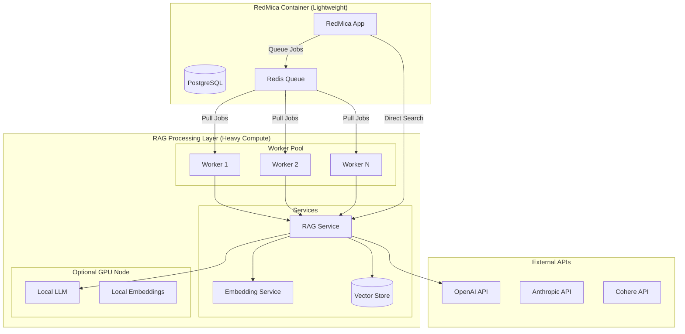

# RedMica RAG Distributed Architecture - CPU Offloading Strategy

## Architecture Overview

The key principle is to keep RedMica lightweight by offloading all heavy computation to dedicated services. RedMica only handles UI, permissions, and lightweight coordination.



## 1. Message Queue Architecture

### Use Sidekiq/Redis for Async Processing

**plugins/redmine_rag/app/jobs/rag_indexing_job.rb**
```ruby
class RagIndexingJob < ApplicationJob
  queue_as :rag_indexing
  sidekiq_options retry: 3, queue: 'rag'
  
  def perform(document_id, operation = 'index')
    document = RagDocument.find(document_id)
    
    case operation
    when 'index'
      # Just send to external service, don't process locally
      RagServiceClient.new.async_index(document)
    when 'update'
      RagServiceClient.new.async_update(document)
    when 'delete'
      RagServiceClient.new.async_delete(document)
    end
  end
end
```

**plugins/redmine_rag/lib/redmine_rag/rag_service_client.rb**
```ruby
module RedmineRag
  class RagServiceClient
    def initialize
      @base_url = Setting.plugin_redmine_rag['rag_service_url']
      @async_endpoint = Setting.plugin_redmine_rag['async_endpoint_url']
    end
    
    def async_index(document)
      # Send to message queue, not direct HTTP
      publish_to_queue('index', {
        id: document.id,
        content: document.content,
        metadata: document.metadata,
        callback_url: callback_url(document)
      })
    end
    
    def search(query, options = {})
      # Synchronous search still needed for user queries
      # But use caching aggressively
      cache_key = "rag_search:#{Digest::SHA256.hexdigest(query + options.to_s)}"
      
      Rails.cache.fetch(cache_key, expires_in: 1.hour) do
        perform_search(query, options)
      end
    end
    
    private
    
    def publish_to_queue(action, payload)
      # Use Redis pub/sub or RabbitMQ
      Redis.current.publish('rag_processing', {
        action: action,
        payload: payload,
        timestamp: Time.current.to_i
      }.to_json)
    end
    
    def callback_url(document)
      Rails.application.routes.url_helpers.rag_callback_url(
        document_id: document.id,
        host: Setting.host_name
      )
    end
  end
end
```

## 2. Dedicated RAG Processing Service

### Separate Container/VM for Heavy Processing

**docker-compose.yml**
```yaml
version: '3.8'

services:
  # RedMica - Minimal CPU usage
  redmica:
    image: redmica:latest
    environment:
      - RAILS_ENV=production
      - REDIS_URL=redis://redis:6379/0
    depends_on:
      - postgres
      - redis
    deploy:
      resources:
        limits:
          cpus: '2'
          memory: 2G
        reservations:
          cpus: '1'
          memory: 1G
    
  # PostgreSQL - Shared database
  postgres:
    image: postgres:14
    volumes:
      - postgres_data:/var/lib/postgresql/data
    deploy:
      resources:
        limits:
          cpus: '2'
          memory: 2G
  
  # Redis - Message queue
  redis:
    image: redis:7-alpine
    deploy:
      resources:
        limits:
          cpus: '0.5'
          memory: 512M
  
  # Sidekiq Workers - Lightweight job processors
  sidekiq:
    image: redmica:latest
    command: bundle exec sidekiq -C config/sidekiq.yml
    environment:
      - RAILS_ENV=production
      - REDIS_URL=redis://redis:6379/0
    depends_on:
      - redis
    deploy:
      replicas: 2
      resources:
        limits:
          cpus: '1'
          memory: 1G
  
  # RAG Service - Heavy compute
  rag-service:
    build: ./rag_service
    environment:
      - REDIS_URL=redis://redis:6379/0
      - VECTOR_DB_URL=http://qdrant:6333
      - USE_GPU=${USE_GPU:-false}
    depends_on:
      - redis
      - qdrant
    deploy:
      replicas: 3
      resources:
        limits:
          cpus: '4'
          memory: 8G
        reservations:
          cpus: '2'
          memory: 4G
  
  # Vector Database - Dedicated vector storage
  qdrant:
    image: qdrant/qdrant
    volumes:
      - qdrant_data:/qdrant/storage
    deploy:
      resources:
        limits:
          cpus: '2'
          memory: 4G
  
  # Optional: Local LLM Service (for on-premise)
  llm-service:
    image: ollama/ollama
    volumes:
      - ollama_models:/root/.ollama
    deploy:
      resources:
        limits:
          cpus: '8'
          memory: 16G
        reservations:
          devices:
            - driver: nvidia
              count: 1
              capabilities: [gpu]

volumes:
  postgres_data:
  qdrant_data:
  ollama_models:
```

## 3. RAG Service Implementation (Python)

### Async Worker with Queue Consumer

**rag_service/worker.py**
```python
import asyncio
import redis
import json
from typing import Dict, Any
from concurrent.futures import ThreadPoolExecutor
import multiprocessing as mp

from langchain.text_splitter import RecursiveCharacterTextSplitter
from langchain_openai import OpenAIEmbeddings
from langchain_community.vectorstores import Qdrant
from qdrant_client import QdrantClient

class RAGWorker:
    def __init__(self):
        self.redis_client = redis.Redis.from_url(os.getenv('REDIS_URL'))
        self.executor = ThreadPoolExecutor(max_workers=mp.cpu_count())
        self.qdrant_client = QdrantClient(url=os.getenv('VECTOR_DB_URL'))
        
        # Initialize components
        self.text_splitter = RecursiveCharacterTextSplitter(
            chunk_size=500,
            chunk_overlap=50
        )
        
        # Use different models based on deployment
        if os.getenv('USE_GPU') == 'true':
            # Use local models for embeddings
            from langchain_community.embeddings import HuggingFaceEmbeddings
            self.embeddings = HuggingFaceEmbeddings(
                model_name="BAAI/bge-large-en-v1.5",
                model_kwargs={'device': 'cuda'},
                encode_kwargs={'device': 'cuda', 'batch_size': 32}
            )
        else:
            # Use API-based embeddings
            self.embeddings = OpenAIEmbeddings(
                model="text-embedding-3-small"  # Cheaper, faster
            )
        
        self.vectorstore = Qdrant(
            client=self.qdrant_client,
            collection_name="redmica_docs",
            embeddings=self.embeddings
        )
    
    async def run(self):
        """Main worker loop"""
        pubsub = self.redis_client.pubsub()
        pubsub.subscribe('rag_processing')
        
        print("RAG Worker started, listening for jobs...")
        
        for message in pubsub.listen():
            if message['type'] == 'message':
                asyncio.create_task(self.process_message(message['data']))
    
    async def process_message(self, message_data: bytes):
        """Process a single message from queue"""
        try:
            message = json.loads(message_data)
            action = message['action']
            payload = message['payload']
            
            if action == 'index':
                await self.index_document(payload)
            elif action == 'search':
                await self.search_documents(payload)
            elif action == 'batch_index':
                await self.batch_index(payload)
                
        except Exception as e:
            print(f"Error processing message: {e}")
            # Send error to monitoring
            self.report_error(e, message_data)
    
    async def index_document(self, payload: Dict[str, Any]):
        """Index a single document"""
        # Run CPU-intensive work in thread pool
        loop = asyncio.get_event_loop()
        
        # Split text in thread pool
        texts = await loop.run_in_executor(
            self.executor,
            self.text_splitter.split_text,
            payload['content']
        )
        
        # Batch embed for efficiency
        metadatas = [payload['metadata']] * len(texts)
        ids = [f"{payload['id']}_{i}" for i in range(len(texts))]
        
        # Add to vector store (this handles embedding)
        await loop.run_in_executor(
            self.executor,
            self.vectorstore.add_texts,
            texts,
            metadatas,
            ids
        )
        
        # Callback to RedMica
        await self.send_callback(payload['callback_url'], {
            'status': 'indexed',
            'document_id': payload['id'],
            'chunks': len(texts)
        })
    
    async def batch_index(self, payload: Dict[str, Any]):
        """Index multiple documents efficiently"""
        documents = payload['documents']
        
        # Process in parallel batches
        batch_size = 10
        for i in range(0, len(documents), batch_size):
            batch = documents[i:i + batch_size]
            tasks = [self.index_document(doc) for doc in batch]
            await asyncio.gather(*tasks)
    
    async def send_callback(self, url: str, data: Dict):
        """Send completion callback to RedMica"""
        import aiohttp
        async with aiohttp.ClientSession() as session:
            async with session.post(url, json=data) as response:
                return await response.json()
```

## 4. Caching Layer

### Aggressive Caching to Reduce Compute

**plugins/redmine_rag/lib/redmine_rag/cache_service.rb**
```ruby
module RedmineRag
  class CacheService
    class << self
      def fetch_search(query, options = {})
        # Multi-level caching
        
        # L1: In-memory cache (fastest)
        memory_key = build_cache_key(query, options)
        result = Rails.cache.fetch(memory_key, expires_in: 5.minutes) do
          
          # L2: Redis cache (shared across instances)
          redis_key = "rag:search:#{memory_key}"
          redis_result = Redis.current.get(redis_key)
          
          if redis_result
            JSON.parse(redis_result)
          else
            # L3: Actual search (slowest)
            search_result = perform_search(query, options)
            
            # Cache in Redis
            Redis.current.setex(redis_key, 1.hour.to_i, search_result.to_json)
            
            search_result
          end
        end
        
        result
      end
      
      def warm_cache(project)
        # Pre-compute common searches
        common_queries = get_common_queries(project)
        
        common_queries.each do |query|
          WarmCacheJob.perform_later(query, project.id)
        end
      end
      
      private
      
      def build_cache_key(query, options)
        # Include user context for personalized results
        components = [
          query.downcase.strip,
          options[:project_id],
          options[:user_id],
          options[:filters]&.sort
        ].compact
        
        Digest::SHA256.hexdigest(components.join(':'))
      end
      
      def get_common_queries(project)
        # Get from analytics
        RagQuery.where(project: project)
                .group(:query)
                .order('COUNT(*) DESC')
                .limit(100)
                .pluck(:query)
      end
    end
  end
end
```

## 5. Edge Caching with CDN

### CloudFlare Workers for Global Edge Computing

**cloudflare-worker/rag-edge.js**
```javascript
// CloudFlare Worker for edge caching and simple queries
addEventListener('fetch', event => {
  event.respondWith(handleRequest(event.request))
})

async function handleRequest(request) {
  const url = new URL(request.url)
  
  // Check if it's a search request
  if (url.pathname === '/api/rag/search') {
    return handleSearch(request)
  }
  
  // Pass through other requests
  return fetch(request)
}

async function handleSearch(request) {
  const { query, project_id } = await request.json()
  
  // Check edge cache first
  const cacheKey = new Request(
    `https://cache.api/${project_id}/${encodeURIComponent(query)}`,
    request
  )
  const cache = caches.default
  
  let response = await cache.match(cacheKey)
  
  if (!response) {
    // Check if it's a simple query we can handle at edge
    if (isSimpleQuery(query)) {
      response = await handleSimpleQuery(query, project_id)
    } else {
      // Forward to origin
      response = await fetch(request)
    }
    
    // Cache the response
    if (response.status === 200) {
      response = new Response(response.body, response)
      response.headers.append('Cache-Control', 'max-age=300')
      event.waitUntil(cache.put(cacheKey, response.clone()))
    }
  }
  
  return response
}

function isSimpleQuery(query) {
  // Simple keyword searches that don't need AI
  return query.split(' ').length <= 3 && 
         !query.includes('?') &&
         !query.match(/how|why|what|when|where/i)
}

async function handleSimpleQuery(query, projectId) {
  // Use CloudFlare's edge KV store for simple lookups
  const results = await SEARCH_INDEX.get(`${projectId}:${query}`)
  
  if (results) {
    return new Response(results, {
      headers: { 'Content-Type': 'application/json' }
    })
  }
  
  return new Response(JSON.stringify({ results: [] }), {
    headers: { 'Content-Type': 'application/json' }
  })
}
```

## 6. Resource Monitoring

### Monitor and Auto-scale Based on Load

**plugins/redmine_rag/app/services/resource_monitor.rb**
```ruby
module RedmineRag
  class ResourceMonitor
    def self.check_health
      {
        redmica_cpu: check_redmica_cpu,
        rag_service: check_rag_service,
        vector_db: check_vector_db,
        queue_depth: check_queue_depth
      }
    end
    
    def self.check_redmica_cpu
      # Monitor RedMica CPU usage
      cpu_percent = `ps aux | grep -E "puma|unicorn" | awk '{print $3}' | awk '{s+=$1} END {print s}'`.to_f
      
      if cpu_percent > 80
        # Offload more work
        Setting.plugin_redmine_rag['aggressive_offload'] = true
        notify_admin("High CPU usage in RedMica: #{cpu_percent}%")
      end
      
      cpu_percent
    end
    
    def self.check_queue_depth
      depth = Sidekiq::Queue.new('rag').size
      
      if depth > 1000
        # Scale up workers
        scale_workers('up')
      elsif depth < 100
        # Scale down workers
        scale_workers('down')
      end
      
      depth
    end
    
    def self.scale_workers(direction)
      if ENV['KUBERNETES_SERVICE_HOST']
        # Kubernetes scaling
        system("kubectl scale deployment rag-workers --replicas=#{new_replica_count(direction)}")
      elsif ENV['DOCKER_HOST']
        # Docker Swarm scaling
        system("docker service scale rag_workers=#{new_replica_count(direction)}")
      end
    end
  end
end
```

## 7. Deployment Options

### Option A: Kubernetes Deployment

**k8s/rag-deployment.yaml**
```yaml
apiVersion: apps/v1
kind: Deployment
metadata:
  name: rag-workers
spec:
  replicas: 3
  selector:
    matchLabels:
      app: rag-worker
  template:
    metadata:
      labels:
        app: rag-worker
    spec:
      containers:
      - name: rag-worker
        image: redmica/rag-worker:latest
        resources:
          requests:
            memory: "4Gi"
            cpu: "2"
          limits:
            memory: "8Gi"
            cpu: "4"
        env:
        - name: WORKER_CONCURRENCY
          value: "4"
        - name: USE_GPU
          value: "false"
      nodeSelector:
        workload: compute-intensive
---
apiVersion: autoscaling/v2
kind: HorizontalPodAutoscaler
metadata:
  name: rag-worker-hpa
spec:
  scaleTargetRef:
    apiVersion: apps/v1
    kind: Deployment
    name: rag-workers
  minReplicas: 2
  maxReplicas: 10
  metrics:
  - type: Resource
    resource:
      name: cpu
      target:
        type: Utilization
        averageUtilization: 70
  - type: Pods
    pods:
      metric:
        name: rabbitmq_queue_messages
      target:
        type: AverageValue
        averageValue: "30"
```

### Option B: Serverless Functions

**serverless/rag-functions.yml**
```yaml
# AWS Lambda / Google Cloud Functions / Azure Functions
service: redmica-rag

provider:
  name: aws
  runtime: python3.9
  memorySize: 3008  # Maximum memory for CPU
  timeout: 300

functions:
  indexDocument:
    handler: handler.index_document
    events:
      - sqs:
          arn: ${env:INDEX_QUEUE_ARN}
          batchSize: 10
    environment:
      VECTOR_DB_URL: ${env:VECTOR_DB_URL}
    reservedConcurrency: 10
    
  searchDocuments:
    handler: handler.search
    events:
      - http:
          path: /search
          method: post
          cors: true
    environment:
      CACHE_URL: ${env:REDIS_URL}
    memorySize: 1024  # Less memory for search
    
  batchIndex:
    handler: handler.batch_index
    events:
      - schedule: rate(1 hour)
    environment:
      BATCH_SIZE: 100
    timeout: 900  # 15 minutes for batch
```

## 8. Cost Optimization

### Intelligent Resource Allocation

**plugins/redmine_rag/lib/redmine_rag/cost_optimizer.rb**
```ruby
module RedmineRag
  class CostOptimizer
    def self.route_request(query, options = {})
      complexity = analyze_query_complexity(query)
      
      case complexity
      when :simple
        # Use cached results or simple search
        handle_simple_query(query, options)
      when :moderate
        # Use smaller model
        handle_moderate_query(query, options)
      when :complex
        # Use full RAG pipeline
        handle_complex_query(query, options)
      end
    end
    
    private
    
    def self.analyze_query_complexity(query)
      # Simple heuristics
      word_count = query.split.length
      has_question = query.include?('?')
      has_complex_terms = query.match(/analyze|compare|explain|summarize/i)
      
      if word_count <= 3 && !has_question
        :simple
      elsif word_count <= 10 && !has_complex_terms
        :moderate
      else
        :complex
      end
    end
    
    def self.handle_simple_query(query, options)
      # Use cache or basic text search
      Rails.cache.fetch("simple:#{query}") do
        Issue.search(query).limit(10)
      end
    end
    
    def self.handle_moderate_query(query, options)
      # Use cheaper embedding model
      RagService.new.search(query, {
        model: 'text-embedding-3-small',
        top_k: 5
      })
    end
    
    def self.handle_complex_query(query, options)
      # Full RAG with reranking
      RagService.new.search(query, {
        model: 'text-embedding-3-large',
        use_reranking: true,
        use_hyde: true,
        top_k: 20
      })
    end
  end
end
```

## Summary of Offloading Strategies

1. **Message Queue Architecture**: All heavy processing goes through queues
2. **Dedicated Services**: RAG operations run in separate containers/VMs
3. **Intelligent Caching**: Multi-level caching reduces compute needs
4. **Edge Computing**: Simple queries handled at CDN edge
5. **Auto-scaling**: Scale workers based on load
6. **Serverless Options**: Use Lambda/Functions for burst capacity
7. **Cost-aware Routing**: Route queries based on complexity

This architecture ensures RedMica container stays lightweight while providing powerful RAG capabilities through distributed computing.