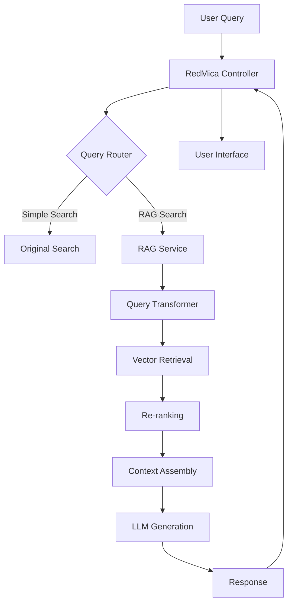

# RedMica RAG Integration Design Document

## Executive Summary

This document outlines the integration of advanced RAG (Retrieval-Augmented Generation) capabilities into RedMica/Redmine to enhance search, documentation, and knowledge management features. The integration will leverage the RAG ecosystem tools identified in our analysis while maintaining compatibility with RedMica's Ruby on Rails architecture.

## Current State Analysis

### RedMica Search Architecture
- **Search Controller**: `/app/controllers/search_controller.rb`
- **Search Module**: `/lib/redmine/search.rb`
- **Tokenizer**: Basic token extraction with CJK support
- **Search Scope**: Project-based with type filtering
- **Caching**: ActiveSupport cache for search results

### Limitations of Current System
1. **Keyword-based search only** - No semantic understanding
2. **No context awareness** - Results lack relevance ranking beyond basic matching
3. **Limited to exact/partial matches** - No conceptual search
4. **No query transformation** - User must know exact terms
5. **No learning from user behavior** - Static search algorithm

## Proposed RAG Integration Architecture

### 1. Plugin-Based Architecture

Create a new RedMica plugin: `redmica_rag_search`

```
/plugins/redmica_rag_search/
├── init.rb                    # Plugin initialization
├── config/
│   ├── routes.rb              # API routes
│   └── settings.yml           # Configuration
├── app/
│   ├── controllers/
│   │   └── rag_search_controller.rb
│   ├── models/
│   │   ├── rag_index.rb
│   │   ├── rag_document.rb
│   │   └── rag_query.rb
│   ├── services/
│   │   ├── embedding_service.rb
│   │   ├── vector_store_service.rb
│   │   ├── query_transformer_service.rb
│   │   └── reranking_service.rb
│   └── views/
│       └── rag_search/
├── lib/
│   ├── redmica_rag/
│   │   ├── indexer.rb
│   │   ├── retriever.rb
│   │   ├── generator.rb
│   │   └── evaluator.rb
│   └── tasks/
│       └── rag.rake           # Rake tasks for indexing
├── db/
│   └── migrate/
│       └── 001_create_rag_tables.rb
└── python/                    # Python microservice
    ├── requirements.txt
    ├── app.py
    └── rag_pipeline/
        ├── indexing.py
        ├── retrieval.py
        ├── generation.py
        └── evaluation.py
```

### 2. Hybrid Ruby-Python Architecture

Since most RAG tools are Python-based, we'll use a microservice approach:

#### Ruby Side (RedMica Plugin)
- **Controllers**: Handle HTTP requests and responses
- **Models**: ActiveRecord models for RAG metadata
- **Services**: Ruby service objects for API communication
- **Views**: Enhanced search UI components

#### Python Side (RAG Microservice)
- **FastAPI/Flask server** for RAG operations
- **LangChain** integration for RAG pipeline
- **Vector store** management (Chroma/Pinecone)
- **LLM interfaces** (OpenAI/local models)

### 3. Data Flow Architecture



## Implementation Components

### Phase 1: Basic RAG Search

#### 1.1 Document Indexing Pipeline

```ruby
# lib/redmica_rag/indexer.rb
module RedmicaRag
  class Indexer
    def index_issue(issue)
      document = {
        id: "issue_#{issue.id}",
        content: build_issue_content(issue),
        metadata: {
          project_id: issue.project_id,
          tracker: issue.tracker.name,
          status: issue.status.name,
          created_at: issue.created_at,
          updated_at: issue.updated_at
        }
      }
      
      # Send to Python service for embedding
      response = RagApiClient.post('/index', document)
      
      # Store reference in database
      RagDocument.create!(
        source_type: 'Issue',
        source_id: issue.id,
        vector_id: response['vector_id'],
        indexed_at: Time.current
      )
    end
    
    private
    
    def build_issue_content(issue)
      [
        "Title: #{issue.subject}",
        "Description: #{issue.description}",
        "Comments: #{issue.journals.map(&:notes).join(' ')}",
        "Attachments: #{issue.attachments.map(&:filename).join(', ')}"
      ].join("\n")
    end
  end
end
```

#### 1.2 Python RAG Service

```python
# python/rag_pipeline/indexing.py
from langchain.text_splitter import RecursiveCharacterTextSplitter
from langchain_openai import OpenAIEmbeddings
from langchain_community.vectorstores import Chroma
from langchain.schema import Document

class RedmicaIndexer:
    def __init__(self):
        self.text_splitter = RecursiveCharacterTextSplitter(
            chunk_size=500,
            chunk_overlap=50
        )
        self.embeddings = OpenAIEmbeddings()
        self.vectorstore = Chroma(
            collection_name="redmica_docs",
            embedding_function=self.embeddings,
            persist_directory="./chroma_db"
        )
    
    def index_document(self, doc_data):
        # Split text into chunks
        texts = self.text_splitter.split_text(doc_data['content'])
        
        # Create documents with metadata
        documents = [
            Document(
                page_content=text,
                metadata={**doc_data['metadata'], 'chunk_index': i}
            )
            for i, text in enumerate(texts)
        ]
        
        # Add to vector store
        ids = self.vectorstore.add_documents(documents)
        return {'vector_ids': ids, 'chunks': len(documents)}
```

### Phase 2: Advanced Query Processing

#### 2.1 Query Transformation Service

```ruby
# app/services/query_transformer_service.rb
class QueryTransformerService
  def transform(query, strategy: :multi_query)
    case strategy
    when :multi_query
      multi_query_generation(query)
    when :hyde
      hyde_generation(query)
    when :step_back
      step_back_prompting(query)
    else
      [query]
    end
  end
  
  private
  
  def multi_query_generation(query)
    response = RagApiClient.post('/transform/multi_query', { query: query })
    response['queries']
  end
  
  def hyde_generation(query)
    response = RagApiClient.post('/transform/hyde', { query: query })
    response['hypothetical_answer']
  end
  
  def step_back_prompting(query)
    response = RagApiClient.post('/transform/step_back', { query: query })
    [query, response['generalized_query']]
  end
end
```

#### 2.2 Python Query Transformation

```python
# python/rag_pipeline/query_transform.py
from langchain.prompts import ChatPromptTemplate
from langchain_openai import ChatOpenAI

class QueryTransformer:
    def __init__(self):
        self.llm = ChatOpenAI(temperature=0)
    
    def multi_query(self, query):
        template = """You are an AI assistant helping with project management queries.
        Generate 3 different versions of this question to retrieve relevant documents:
        
        Original question: {question}
        
        Alternative questions:"""
        
        prompt = ChatPromptTemplate.from_template(template)
        chain = prompt | self.llm
        response = chain.invoke({"question": query})
        
        # Parse and return multiple queries
        queries = response.content.strip().split('\n')
        return [q.strip() for q in queries if q.strip()]
    
    def hyde(self, query):
        template = """Write a detailed answer to this question as if you were 
        documenting it in a project management system:
        
        Question: {question}
        
        Detailed Answer:"""
        
        prompt = ChatPromptTemplate.from_template(template)
        chain = prompt | self.llm
        response = chain.invoke({"question": query})
        return response.content
```

### Phase 3: Intelligent Routing

#### 3.1 Query Router

```ruby
# app/models/rag_query.rb
class RagQuery < ApplicationRecord
  def route
    # Determine query type and route accordingly
    if technical_query?
      route_to_code_search
    elsif temporal_query?
      route_to_timeline_search
    elsif user_query?
      route_to_user_search
    else
      route_to_general_search
    end
  end
  
  private
  
  def technical_query?
    query.match?(/\b(code|api|function|class|method|bug|error)\b/i)
  end
  
  def temporal_query?
    query.match?(/\b(today|yesterday|week|month|year|recent|latest)\b/i)
  end
  
  def user_query?
    query.match?(/@\w+|assigned to|created by|mentioned/)
  end
end
```

### Phase 4: Re-ranking and Generation

#### 4.1 Re-ranking Service

```python
# python/rag_pipeline/reranking.py
from typing import List, Tuple
import cohere

class Reranker:
    def __init__(self):
        self.cohere = cohere.Client()
        
    def rerank_results(self, query: str, documents: List[dict]) -> List[dict]:
        # Use Cohere rerank
        results = self.cohere.rerank(
            query=query,
            documents=[doc['content'] for doc in documents],
            top_n=10
        )
        
        # Apply RRF for multiple queries
        if isinstance(query, list):
            return self.reciprocal_rank_fusion(query, documents)
        
        # Return reranked documents
        reranked = []
        for result in results:
            doc = documents[result.index]
            doc['relevance_score'] = result.relevance_score
            reranked.append(doc)
        
        return reranked
    
    def reciprocal_rank_fusion(self, queries: List[str], 
                              documents: List[dict], k=60) -> List[dict]:
        fused_scores = {}
        
        for query in queries:
            ranked = self.rerank_results(query, documents)
            for rank, doc in enumerate(ranked):
                doc_id = doc['id']
                if doc_id not in fused_scores:
                    fused_scores[doc_id] = 0
                fused_scores[doc_id] += 1 / (rank + k)
        
        # Sort by fused score
        sorted_docs = sorted(
            documents,
            key=lambda d: fused_scores.get(d['id'], 0),
            reverse=True
        )
        
        return sorted_docs
```

### Phase 5: UI Integration

#### 5.1 Enhanced Search Interface

```erb
<!-- app/views/rag_search/index.html.erb -->
<div class="rag-search-container">
  <%= form_tag rag_search_path, method: :get, id: 'rag-search-form' do %>
    <div class="search-input-group">
      <%= text_field_tag 'q', @query, 
          placeholder: 'Ask a question or search...', 
          class: 'rag-search-input' %>
      
      <div class="search-options">
        <%= check_box_tag 'use_rag', '1', @use_rag %>
        <%= label_tag 'use_rag', 'Smart Search (AI-powered)' %>
        
        <%= select_tag 'search_mode', 
            options_for_select([
              ['Semantic', 'semantic'],
              ['Hybrid', 'hybrid'],
              ['Classic', 'classic']
            ], @search_mode) %>
      </div>
    </div>
    
    <%= submit_tag 'Search', class: 'btn btn-primary' %>
  <% end %>
  
  <% if @results %>
    <div class="search-results">
      <div class="result-summary">
        Found <%= @results.count %> results
        <% if @use_rag %>
          <span class="ai-badge">AI Enhanced</span>
        <% end %>
      </div>
      
      <% @results.each do |result| %>
        <div class="search-result-item" data-relevance="<%= result.relevance_score %>">
          <h3><%= link_to result.title, result.url %></h3>
          <div class="result-metadata">
            <%= result.type %> • <%= result.project %> • 
            <%= time_ago_in_words(result.updated_at) %> ago
          </div>
          <div class="result-snippet">
            <%= highlight_search_terms(result.snippet, @query) %>
          </div>
          <% if result.ai_summary %>
            <div class="ai-summary">
              <span class="ai-label">AI Summary:</span>
              <%= result.ai_summary %>
            </div>
          <% end %>
        </div>
      <% end %>
    </div>
  <% end %>
</div>
```

#### 5.2 JavaScript Enhancement

```javascript
// app/assets/javascripts/rag_search.js
class RagSearch {
  constructor() {
    this.form = document.getElementById('rag-search-form');
    this.input = document.querySelector('.rag-search-input');
    this.setupAutocomplete();
    this.setupQuerySuggestions();
  }
  
  setupAutocomplete() {
    let timeout;
    this.input.addEventListener('input', (e) => {
      clearTimeout(timeout);
      timeout = setTimeout(() => {
        this.fetchSuggestions(e.target.value);
      }, 300);
    });
  }
  
  async fetchSuggestions(query) {
    if (query.length < 3) return;
    
    const response = await fetch(`/rag_search/suggestions?q=${query}`);
    const suggestions = await response.json();
    
    this.displaySuggestions(suggestions);
  }
  
  displaySuggestions(suggestions) {
    // Display query suggestions and related searches
    const container = document.createElement('div');
    container.className = 'search-suggestions';
    
    suggestions.forEach(suggestion => {
      const item = document.createElement('div');
      item.className = 'suggestion-item';
      item.textContent = suggestion.text;
      item.onclick = () => {
        this.input.value = suggestion.text;
        this.form.submit();
      };
      container.appendChild(item);
    });
    
    // Append to DOM
    this.input.parentNode.appendChild(container);
  }
}
```

## Configuration Management

### Settings Configuration

```yaml
# config/settings.yml
rag_search:
  enabled: true
  
  # LLM Configuration
  llm:
    provider: openai
    model: gpt-3.5-turbo
    temperature: 0
    api_key: <%= ENV['OPENAI_API_KEY'] %>
  
  # Embedding Configuration
  embeddings:
    provider: openai
    model: text-embedding-ada-002
    dimension: 1536
  
  # Vector Store Configuration
  vector_store:
    type: chroma
    persist_directory: <%= Rails.root.join('tmp', 'chroma') %>
    collection_name: redmica_docs
  
  # Search Configuration
  search:
    chunk_size: 500
    chunk_overlap: 50
    top_k: 10
    rerank: true
    use_hyde: false
    use_multiquery: true
  
  # Caching
  cache:
    enabled: true
    ttl: 3600
    
  # Python Service
  python_service:
    url: http://localhost:8000
    timeout: 30
```

## Database Schema

```sql
-- RAG Documents table
CREATE TABLE rag_documents (
  id BIGSERIAL PRIMARY KEY,
  source_type VARCHAR(50) NOT NULL,
  source_id BIGINT NOT NULL,
  vector_id VARCHAR(255),
  content TEXT,
  metadata JSONB,
  indexed_at TIMESTAMP,
  created_at TIMESTAMP NOT NULL,
  updated_at TIMESTAMP NOT NULL,
  INDEX idx_rag_source (source_type, source_id),
  INDEX idx_rag_vector (vector_id)
);

-- RAG Queries table for analytics
CREATE TABLE rag_queries (
  id BIGSERIAL PRIMARY KEY,
  user_id BIGINT,
  query TEXT NOT NULL,
  transformed_queries JSONB,
  results_count INTEGER,
  strategy VARCHAR(50),
  response_time FLOAT,
  created_at TIMESTAMP NOT NULL,
  INDEX idx_rag_queries_user (user_id),
  INDEX idx_rag_queries_created (created_at)
);

-- RAG Feedback table
CREATE TABLE rag_feedback (
  id BIGSERIAL PRIMARY KEY,
  query_id BIGINT REFERENCES rag_queries(id),
  user_id BIGINT,
  result_id VARCHAR(255),
  feedback_type VARCHAR(20), -- 'helpful', 'not_helpful', 'incorrect'
  comment TEXT,
  created_at TIMESTAMP NOT NULL,
  INDEX idx_rag_feedback_query (query_id)
);
```

## Deployment Strategy

### Docker Compose Configuration

```yaml
# docker-compose.yml
version: '3.8'

services:
  redmica:
    build: .
    environment:
      - RAG_SERVICE_URL=http://rag-service:8000
    depends_on:
      - postgres
      - rag-service
    
  rag-service:
    build: ./plugins/redmica_rag_search/python
    ports:
      - "8000:8000"
    environment:
      - OPENAI_API_KEY=${OPENAI_API_KEY}
      - CHROMA_PERSIST_DIR=/data/chroma
    volumes:
      - chroma-data:/data/chroma
    
  postgres:
    image: postgres:14
    environment:
      - POSTGRES_DB=redmica
      - POSTGRES_USER=redmica
      - POSTGRES_PASSWORD=redmica
    volumes:
      - postgres-data:/var/lib/postgresql/data

volumes:
  chroma-data:
  postgres-data:
```

## Rake Tasks

```ruby
# lib/tasks/rag.rake
namespace :rag do
  desc "Index all existing content for RAG search"
  task index_all: :environment do
    puts "Starting RAG indexing..."
    
    # Index issues
    Issue.find_each do |issue|
      RedmicaRag::Indexer.new.index_issue(issue)
      print "."
    end
    
    # Index wiki pages
    WikiPage.find_each do |page|
      RedmicaRag::Indexer.new.index_wiki_page(page)
      print "."
    end
    
    # Index documents
    Document.find_each do |document|
      RedmicaRag::Indexer.new.index_document(document)
      print "."
    end
    
    puts "\nIndexing complete!"
  end
  
  desc "Clear RAG index"
  task clear_index: :environment do
    RagDocument.destroy_all
    # Call Python service to clear vector store
    RagApiClient.delete('/index/clear')
    puts "RAG index cleared"
  end
  
  desc "Evaluate RAG performance"
  task evaluate: :environment do
    evaluator = RedmicaRag::Evaluator.new
    results = evaluator.run_evaluation
    puts "Evaluation Results:"
    puts "Precision: #{results[:precision]}"
    puts "Recall: #{results[:recall]}"
    puts "F1 Score: #{results[:f1_score]}"
  end
end
```

## Performance Optimization

### Caching Strategy

```ruby
# app/services/rag_cache_service.rb
class RagCacheService
  def self.fetch(query, options = {})
    cache_key = generate_cache_key(query, options)
    
    Rails.cache.fetch(cache_key, expires_in: 1.hour) do
      yield
    end
  end
  
  private
  
  def self.generate_cache_key(query, options)
    Digest::SHA256.hexdigest([
      'rag_search',
      query.downcase.strip,
      options[:project_id],
      options[:user_id],
      options[:search_mode]
    ].compact.join(':'))
  end
end
```

### Batch Processing

```ruby
# app/jobs/rag_indexing_job.rb
class RagIndexingJob < ApplicationJob
  queue_as :low
  
  def perform(model_class, ids)
    records = model_class.where(id: ids)
    
    documents = records.map do |record|
      {
        id: "#{model_class.name.underscore}_#{record.id}",
        content: extract_content(record),
        metadata: extract_metadata(record)
      }
    end
    
    # Send batch to Python service
    RagApiClient.post('/index/batch', { documents: documents })
  end
end
```

## Monitoring and Analytics

### Metrics Collection

```ruby
# app/services/rag_metrics_service.rb
class RagMetricsService
  def track_query(query, results, response_time)
    RagQuery.create!(
      user_id: User.current.id,
      query: query,
      results_count: results.count,
      response_time: response_time,
      strategy: determine_strategy(query)
    )
    
    # Send to monitoring service
    StatsD.timing('rag.query.response_time', response_time)
    StatsD.increment('rag.query.count')
  end
  
  def track_feedback(query_id, feedback_type, result_id = nil)
    RagFeedback.create!(
      query_id: query_id,
      user_id: User.current.id,
      feedback_type: feedback_type,
      result_id: result_id
    )
    
    StatsD.increment("rag.feedback.#{feedback_type}")
  end
end
```

## Security Considerations

1. **API Key Management**: Store in environment variables
2. **Rate Limiting**: Implement per-user rate limits
3. **Content Filtering**: Sanitize inputs before sending to LLM
4. **Access Control**: Respect RedMica's existing permissions
5. **Data Privacy**: Ensure sensitive data is not sent to external APIs

## Migration Path

### Phase 1: Foundation (Weeks 1-2)
- Set up plugin structure
- Implement basic Python service
- Create database tables
- Basic indexing for issues

### Phase 2: Core RAG (Weeks 3-4)
- Implement vector store
- Basic semantic search
- Query transformation (multi-query)
- Simple UI integration

### Phase 3: Advanced Features (Weeks 5-6)
- Re-ranking implementation
- HyDE and step-back prompting
- Query routing
- Enhanced UI with suggestions

### Phase 4: Optimization (Weeks 7-8)
- Caching implementation
- Batch processing
- Performance tuning
- Monitoring setup

### Phase 5: Evaluation (Week 9)
- Implement evaluation metrics
- A/B testing setup
- User feedback collection
- Performance benchmarking

## Success Metrics

1. **Search Quality**
   - Precision: > 0.8
   - Recall: > 0.7
   - User satisfaction: > 4.0/5.0

2. **Performance**
   - Query response time: < 2 seconds
   - Indexing throughput: > 100 docs/minute
   - Cache hit rate: > 60%

3. **Adoption**
   - RAG search usage: > 30% of total searches
   - User retention: > 70% continue using after first try
   - Feedback submission rate: > 5%

## Conclusion

This RAG integration will transform RedMica's search capabilities from keyword-based to semantic understanding, providing users with more relevant results and natural language interaction. The phased approach ensures minimal disruption while gradually introducing advanced features.