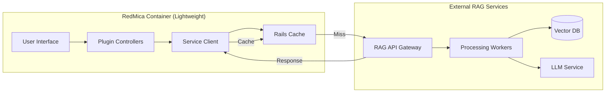

# RedMica RAG Plugin - External Service Client Architecture

## Architecture Overview

The RedMica plugin is a **thin client** that only handles:
1. UI/UX interactions
2. Permission checks
3. API calls to external services
4. Response formatting

All heavy processing happens in external services.



## Plugin Client Implementation

### 1. Main Service Client

**plugins/redmine_rag/lib/redmine_rag/service_client.rb**

```ruby
require 'net/http'
require 'json'

module RedmineRag
  class ServiceClient
    class ServiceError < StandardError; end
    class ServiceUnavailable < ServiceError; end
    
    def initialize
      @base_url = Setting.plugin_redmine_rag['service_url'] || 'http://localhost:8000'
      @api_key = Setting.plugin_redmine_rag['api_key']
      @timeout = Setting.plugin_redmine_rag['timeout'] || 30
      @use_cache = Setting.plugin_redmine_rag['enable_cache'] != false
    end
    
    # Search - Synchronous call for user queries
    def search(query, options = {})
      return cached_search(query, options) if @use_cache
      
      post_request('/api/v1/search', {
        query: query,
        project_id: options[:project_id],
        user_id: options[:user_id],
        filters: options[:filters],
        limit: options[:limit] || 10,
        search_type: options[:search_type] || 'hybrid'
      })
    rescue Net::ReadTimeout, Net::OpenTimeout
      # Fallback to basic search if service is slow
      fallback_to_basic_search(query, options)
    rescue ServiceUnavailable => e
      Rails.logger.error "RAG Service unavailable: #{e.message}"
      fallback_to_basic_search(query, options)
    end
    
    # Index - Asynchronous, fire-and-forget
    def index_document(doc_type, doc_id, content, metadata = {})
      # Don't wait for response, just queue it
      IndexingJob.perform_later({
        document_type: doc_type,
        document_id: doc_id,
        content: content,
        metadata: metadata
      })
      
      true # Always return success to not block RedMica
    rescue => e
      Rails.logger.error "Failed to queue indexing: #{e.message}"
      false
    end
    
    # Batch index - For bulk operations
    def batch_index(documents)
      # Send to batch endpoint
      post_request('/api/v1/batch_index', {
        documents: documents
      }, timeout: 120) # Longer timeout for batch
      
    rescue => e
      # Queue for retry later
      documents.each do |doc|
        IndexingJob.perform_later(doc)
      end
    end
    
    # Get suggestions - Fast, cached endpoint
    def get_suggestions(query)
      return [] if query.length < 3
      
      Rails.cache.fetch("suggestions:#{query}", expires_in: 1.hour) do
        get_request('/api/v1/suggestions', { q: query })
      end
    rescue
      [] # Return empty array on any error
    end
    
    # Check service health
    def health_check
      response = get_request('/health', {}, timeout: 5)
      response[:status] == 'healthy'
    rescue
      false
    end
    
    private
    
    def cached_search(query, options)
      cache_key = build_cache_key('search', query, options)
      
      Rails.cache.fetch(cache_key, expires_in: cache_ttl(query)) do
        post_request('/api/v1/search', {
          query: query,
          project_id: options[:project_id],
          user_id: options[:user_id],
          filters: options[:filters],
          limit: options[:limit] || 10
        })
      end
    end
    
    def cache_ttl(query)
      # Longer cache for common queries
      if common_query?(query)
        1.hour
      else
        5.minutes
      end
    end
    
    def common_query?(query)
      # Check if query is in top 100 common queries
      CommonQueries.instance.include?(query.downcase.strip)
    end
    
    def build_cache_key(prefix, query, options)
      components = [
        prefix,
        Digest::SHA256.hexdigest(query.downcase.strip),
        options[:project_id],
        options[:user_id],
        options[:filters]&.sort&.join('-')
      ].compact
      
      components.join(':')
    end
    
    def post_request(endpoint, data, timeout: @timeout)
      uri = URI("#{@base_url}#{endpoint}")
      
      http = Net::HTTP.new(uri.host, uri.port)
      http.use_ssl = uri.scheme == 'https'
      http.open_timeout = 5
      http.read_timeout = timeout
      
      request = Net::HTTP::Post.new(uri)
      request['Content-Type'] = 'application/json'
      request['Authorization'] = "Bearer #{@api_key}" if @api_key
      request['X-Client-Version'] = RedmineRag::VERSION
      request.body = data.to_json
      
      response = http.request(request)
      
      case response.code
      when '200', '201'
        JSON.parse(response.body, symbolize_names: true)
      when '503', '502', '504'
        raise ServiceUnavailable, "Service returned #{response.code}"
      else
        raise ServiceError, "Service returned #{response.code}: #{response.body}"
      end
    end
    
    def get_request(endpoint, params = {}, timeout: @timeout)
      uri = URI("#{@base_url}#{endpoint}")
      uri.query = URI.encode_www_form(params) if params.any?
      
      http = Net::HTTP.new(uri.host, uri.port)
      http.use_ssl = uri.scheme == 'https'
      http.open_timeout = 5
      http.read_timeout = timeout
      
      request = Net::HTTP::Get.new(uri)
      request['Authorization'] = "Bearer #{@api_key}" if @api_key
      
      response = http.request(request)
      
      if response.code == '200'
        JSON.parse(response.body, symbolize_names: true)
      else
        raise ServiceError, "Service returned #{response.code}"
      end
    end
    
    def fallback_to_basic_search(query, options)
      # Use Redmine's built-in search when RAG service is down
      Rails.logger.info "Falling back to basic search for query: #{query}"
      
      results = []
      
      if options[:project_id]
        project = Project.find_by(id: options[:project_id])
        scope = project ? project.issues : Issue
      else
        scope = Issue
      end
      
      issues = scope.visible
                   .where("subject ILIKE ? OR description ILIKE ?", 
                          "%#{query}%", "%#{query}%")
                   .limit(options[:limit] || 10)
      
      issues.each do |issue|
        results << {
          type: 'Issue',
          id: issue.id,
          title: issue.subject,
          url: Rails.application.routes.url_helpers.issue_path(issue),
          snippet: truncate_text(issue.description, query),
          score: calculate_basic_score(issue, query),
          metadata: {
            project: issue.project.name,
            status: issue.status.name,
            updated_at: issue.updated_on
          }
        }
      end
      
      { results: results, fallback: true }
    end
    
    def truncate_text(text, query, length = 200)
      return '' if text.blank?
      
      # Find query position and extract surrounding context
      position = text.downcase.index(query.downcase) || 0
      start_pos = [position - 100, 0].max
      end_pos = [position + 100, text.length].min
      
      excerpt = text[start_pos...end_pos]
      excerpt = "...#{excerpt}" if start_pos > 0
      excerpt = "#{excerpt}..." if end_pos < text.length
      
      excerpt
    end
    
    def calculate_basic_score(issue, query)
      score = 0.0
      query_terms = query.downcase.split
      
      # Score based on title matches
      title_matches = query_terms.count { |term| issue.subject.downcase.include?(term) }
      score += title_matches * 0.3
      
      # Score based on description matches
      if issue.description.present?
        desc_matches = query_terms.count { |term| issue.description.downcase.include?(term) }
        score += desc_matches * 0.1
      end
      
      # Boost recent issues
      days_old = (Date.current - issue.updated_on.to_date).to_i
      recency_boost = [1.0 - (days_old / 365.0), 0].max
      score += recency_boost * 0.2
      
      [score, 1.0].min # Cap at 1.0
    end
  end
end
```

### 2. Async Indexing Job

**plugins/redmine_rag/app/jobs/indexing_job.rb**

```ruby
class IndexingJob < ApplicationJob
  queue_as :rag_indexing
  
  # Retry with exponential backoff
  retry_on Net::ReadTimeout, wait: :exponentially_longer, attempts: 5
  retry_on RedmineRag::ServiceClient::ServiceUnavailable, wait: 1.hour, attempts: 3
  
  def perform(document_data)
    client = RedmineRag::ServiceClient.new
    
    # Send to external service
    response = client.post_request('/api/v1/index', document_data)
    
    # Update local tracking if successful
    if response[:success]
      RagDocument.where(
        source_type: document_data[:document_type],
        source_id: document_data[:document_id]
      ).update_all(
        indexed_at: Time.current,
        vector_id: response[:vector_id]
      )
    end
  end
end
```

### 3. Controller Using the Client

**plugins/redmine_rag/app/controllers/rag_search_controller.rb**

```ruby
class RagSearchController < ApplicationController
  before_action :find_project
  before_action :check_service_health, only: [:search]
  
  def search
    @query = params[:q]
    return if @query.blank?
    
    # Initialize client
    client = RedmineRag::ServiceClient.new
    
    # Perform search via external service
    start_time = Time.current
    result = client.search(@query, {
      project_id: @project&.id,
      user_id: User.current.id,
      filters: build_filters,
      search_type: params[:search_type] || 'hybrid'
    })
    
    # Log metrics
    log_search_metrics(@query, result, Time.current - start_time)
    
    # Format results for view
    @results = format_results(result[:results])
    @fallback_mode = result[:fallback] || false
    
    respond_to do |format|
      format.html
      format.json { render json: @results }
    end
  end
  
  def suggestions
    client = RedmineRag::ServiceClient.new
    suggestions = client.get_suggestions(params[:q])
    
    render json: suggestions
  end
  
  private
  
  def check_service_health
    unless service_available?
      flash.now[:warning] = "AI search is temporarily unavailable. Using basic search."
    end
  end
  
  def service_available?
    Rails.cache.fetch('rag_service:health', expires_in: 1.minute) do
      RedmineRag::ServiceClient.new.health_check
    end
  end
  
  def build_filters
    filters = {}
    filters[:status] = params[:status] if params[:status].present?
    filters[:tracker] = params[:tracker] if params[:tracker].present?
    filters[:date_from] = params[:date_from] if params[:date_from].present?
    filters[:date_to] = params[:date_to] if params[:date_to].present?
    filters
  end
  
  def format_results(results)
    return [] unless results
    
    results.map do |result|
      {
        type: result[:type],
        title: result[:title],
        url: result[:url],
        snippet: highlight_snippet(result[:snippet], @query),
        score: result[:score],
        metadata: result[:metadata],
        ai_summary: result[:ai_summary]
      }
    end
  end
  
  def highlight_snippet(text, query)
    return text if query.blank?
    
    terms = query.split.map { |t| Regexp.escape(t) }
    pattern = /(#{terms.join('|')})/i
    
    text.gsub(pattern, '<mark>\1</mark>').html_safe
  end
  
  def log_search_metrics(query, result, duration)
    RagQuery.create!(
      user_id: User.current.id,
      project_id: @project&.id,
      query: query,
      results_count: result[:results]&.size || 0,
      response_time: duration,
      fallback_used: result[:fallback] || false
    )
  end
end
```

### 4. External Service API Specification

**External RAG Service API (Python/Node.js/Go)**

```yaml
openapi: 3.0.0
info:
  title: RedMica RAG Service API
  version: 1.0.0
  
servers:
  - url: http://rag-service.internal:8000/api/v1
  
paths:
  /health:
    get:
      summary: Health check
      responses:
        '200':
          description: Service is healthy
          content:
            application/json:
              schema:
                type: object
                properties:
                  status:
                    type: string
                    enum: [healthy, degraded, unhealthy]
                  version:
                    type: string
                  uptime:
                    type: integer
  
  /search:
    post:
      summary: Perform RAG search
      requestBody:
        required: true
        content:
          application/json:
            schema:
              type: object
              required:
                - query
              properties:
                query:
                  type: string
                project_id:
                  type: integer
                user_id:
                  type: integer
                filters:
                  type: object
                limit:
                  type: integer
                  default: 10
                search_type:
                  type: string
                  enum: [semantic, keyword, hybrid]
                  default: hybrid
      responses:
        '200':
          description: Search results
          content:
            application/json:
              schema:
                type: object
                properties:
                  results:
                    type: array
                    items:
                      $ref: '#/components/schemas/SearchResult'
                  total:
                    type: integer
                  took_ms:
                    type: integer
  
  /index:
    post:
      summary: Index a document
      requestBody:
        required: true
        content:
          application/json:
            schema:
              type: object
              required:
                - document_type
                - document_id
                - content
              properties:
                document_type:
                  type: string
                document_id:
                  type: string
                content:
                  type: string
                metadata:
                  type: object
      responses:
        '201':
          description: Document indexed
          content:
            application/json:
              schema:
                type: object
                properties:
                  success:
                    type: boolean
                  vector_id:
                    type: string
                  chunks_created:
                    type: integer
  
  /batch_index:
    post:
      summary: Index multiple documents
      requestBody:
        required: true
        content:
          application/json:
            schema:
              type: object
              properties:
                documents:
                  type: array
                  items:
                    type: object
      responses:
        '202':
          description: Batch indexing started
          content:
            application/json:
              schema:
                type: object
                properties:
                  job_id:
                    type: string
                  documents_queued:
                    type: integer
  
  /suggestions:
    get:
      summary: Get search suggestions
      parameters:
        - name: q
          in: query
          required: true
          schema:
            type: string
      responses:
        '200':
          description: Suggestions
          content:
            application/json:
              schema:
                type: array
                items:
                  type: string

components:
  schemas:
    SearchResult:
      type: object
      properties:
        type:
          type: string
        id:
          type: string
        title:
          type: string
        url:
          type: string
        snippet:
          type: string
        score:
          type: number
        ai_summary:
          type: string
        metadata:
          type: object
```

### 5. Configuration in plugin settings

**plugins/redmine_rag/app/views/settings/_rag_settings.html.erb**

```erb
<h3>External Service Configuration</h3>

<table>
  <tr>
    <th>Service URL</th>
    <td>
      <%= text_field_tag 'settings[service_url]', 
          settings['service_url'] || 'http://localhost:8000',
          size: 60,
          placeholder: 'http://rag-service.example.com' %>
      <em class="info">URL of the external RAG service</em>
    </td>
  </tr>
  
  <tr>
    <th>API Key</th>
    <td>
      <%= password_field_tag 'settings[api_key]', 
          settings['api_key'],
          size: 40,
          placeholder: 'Optional API key for authentication' %>
    </td>
  </tr>
  
  <tr>
    <th>Timeout (seconds)</th>
    <td>
      <%= number_field_tag 'settings[timeout]', 
          settings['timeout'] || 30,
          min: 5, max: 120 %>
      <em class="info">Maximum wait time for service responses</em>
    </td>
  </tr>
  
  <tr>
    <th>Enable Cache</th>
    <td>
      <%= check_box_tag 'settings[enable_cache]', 
          '1', 
          settings['enable_cache'] != false %>
      <%= label_tag 'settings[enable_cache]', 'Cache search results' %>
    </td>
  </tr>
  
  <tr>
    <th>Fallback Mode</th>
    <td>
      <%= select_tag 'settings[fallback_mode]',
          options_for_select([
            ['Use basic search', 'basic'],
            ['Show error message', 'error'],
            ['Disable search', 'disable']
          ], settings['fallback_mode'] || 'basic') %>
      <em class="info">What to do when service is unavailable</em>
    </td>
  </tr>
</table>

<div class="contextual">
  <%= link_to 'Test Connection', 
      test_connection_admin_rag_settings_path,
      method: :post,
      remote: true,
      class: 'icon icon-test' %>
</div>

<div id="connection-test-result"></div>
```

## Benefits of This Architecture

1. **RedMica stays lightweight**: No heavy libraries, models, or processing
2. **Service independence**: Can update/scale RAG service without touching RedMica
3. **Fallback capability**: Basic search works even if RAG service is down
4. **Language agnostic**: RAG service can be Python, Node.js, Go, Rust, etc.
5. **Cloud-friendly**: Can use managed services (AWS SageMaker, Google Vertex AI)
6. **Cost efficient**: Can shut down RAG service during low usage
7. **Easy debugging**: Clear separation between UI and processing
8. **Multiple deployment options**: On-premise, cloud, hybrid

The plugin is essentially a **smart API client** that handles:
- Making HTTP requests to external services
- Caching responses
- Falling back gracefully when service is unavailable
- Formatting results for display
- Managing background jobs for indexing

All the heavy lifting (embeddings, vector search, LLM calls) happens in the external service!